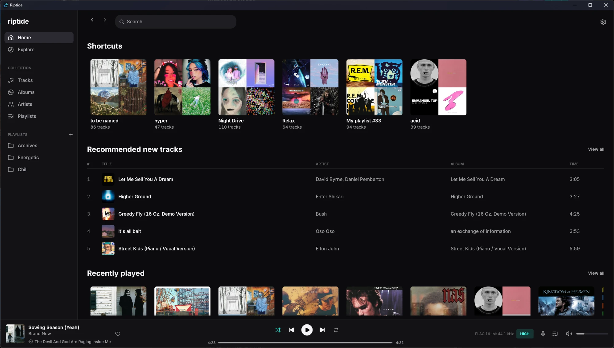

# Riptide

A small, fast desktop player for TIDAL, written in Rust.



TIDAL's own desktop app is a web app in a window: several processes and around half a gigabyte of
memory to play music. Riptide is one native program. On the same Windows PC, playing the same
playlist, it used about 250 MB in one process against TIDAL's 520 MB across eight, sits at 0% CPU
when idle, and spends under 1% of one core decoding 24-bit/192 kHz FLAC.

Riptide is unofficial and not affiliated with TIDAL. You need a paid TIDAL subscription.

## What it does

- **Your library**: tracks, albums, artists, playlists and playlist folders. Create, rename,
  reorder, move into folders and delete playlists; add tracks to playlists.
- **Browsing**: Home, Explore and genres, artist pages with discography and bio, mixes, track and
  artist radio, and search that updates as you type.
- **Sound**: Max (up to 24-bit/192 kHz FLAC), High (16-bit/44.1 kHz FLAC) or Low (AAC). Optional
  volume normalization, and a choice of output device.
- **Lyrics**: synced lyrics in a full-window view beside the cover. Click a line to jump to it.
- **Playback**: queue, shuffle, repeat, autoplay when a list runs out, and it picks up where you
  left off when you reopen it.
- **The rest of the desktop**: media keys and the system's media controls, a tray icon (closing to
  the tray is optional), Last.fm scrobbling, and "Listening to" status on Discord.
- **Themes**: Catppuccin, Nord, Rosé Pine, Tokyo Night and others, each a small file you can copy
  and edit.

What it doesn't do: music videos, Dolby Atmos, offline downloads, crossfade, or controlling
playback on other devices.

## Install

Download the build for your system from the
[latest release](https://github.com/pherber3/riptide/releases/latest).

**Windows 10 or 11**: unzip `riptide-windows-x64.zip` wherever you like and run `riptide.exe`.
Riptide keeps its data next to itself, so the folder is the whole install; delete it to remove
everything. The first time, Windows may warn that it doesn't recognise the app: choose
**More info**, then **Run anyway**.

**macOS 11 or later** (Apple silicon or Intel): unzip `riptide-macos-universal.zip` and move
**Riptide** to Applications. The app isn't signed with an Apple developer certificate, so macOS
will refuse to open it the first time. Open **System Settings → Privacy & Security**, scroll down
and click **Open Anyway** next to the message about Riptide.

**Linux** (x86-64, X11 or Wayland): extract `riptide-linux-x64.tar.gz` and run `riptide` from the
extracted folder.

## Signing in

Click **Sign in with Tidal**. Your browser opens TIDAL's login page. After you log in, TIDAL sends
you to a page that doesn't load: copy its address from the address bar, paste it into Riptide and
click **Continue**.

That copy and paste is the price of Max quality: it's the only kind of sign-in TIDAL gives
24-bit streams to. You only do it once; Riptide stays signed in from then on.

## Last.fm

Scrobbling uses your own Last.fm API account, which takes a minute to set up:

1. Create an API account at <https://www.last.fm/api/account/create> (only the application name
   is required).
2. Make a file called `lastfm.txt` in Riptide's data folder (see below) with these two lines:

   ```
   key=your API key
   secret=your shared secret
   ```

3. In Riptide, open **Settings → Connections → Last.fm → Connect** and approve it in the page that
   opens.

## Where things are kept

| | Data (sign-in, settings, queue, themes) | Cache |
|---|---|---|
| Windows | `data` next to `riptide.exe` | `cache` next to `riptide.exe` |
| macOS | `~/Library/Application Support/Riptide/data` | `…/Riptide/cache` |
| Linux | `~/.local/share/riptide/data` | `~/.local/share/riptide/cache` |

**Settings → About → Open folder** opens it. The cache holds recently played tracks (up to 2 GB)
and artwork, and can be deleted at any time.

## Themes

Themes are JSON palette files in the `themes` folder inside the data folder. To make your own,
copy one, rename it and change its colours; it shows up in **Settings → Appearance → Theme**.
**Open folder** next to the theme list takes you there.

## Building from source

You need a recent stable Rust (`rustup update`).

```sh
cargo build --release
```

The program is `target/release/riptide` (`riptide.exe` on Windows). On Windows, `install.ps1`
builds it and installs it to `%LOCALAPPDATA%\Programs\Riptide` with a Start menu shortcut.

On Debian or Ubuntu, building needs:

```sh
sudo apt install pkg-config cmake libclang-dev libasound2-dev libpulse-dev libdbus-1-dev \
  libxkbcommon-dev libwayland-dev libgl1-mesa-dev
```

## Notes

Riptide talks to the same API as TIDAL's own apps and signs in the way TIDAL's Android app does,
so TIDAL could stop it working at any time.

It is built with [egui](https://github.com/emilk/egui) and the
[fastframe](https://github.com/crmne/fastframe) crates from
[Spotifast](https://github.com/crmne/spotifast), which showed how small a desktop music player can
be. Icons are from [Lucide](https://lucide.dev).

MIT License.
